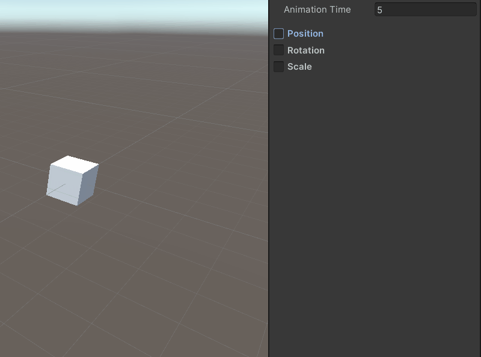
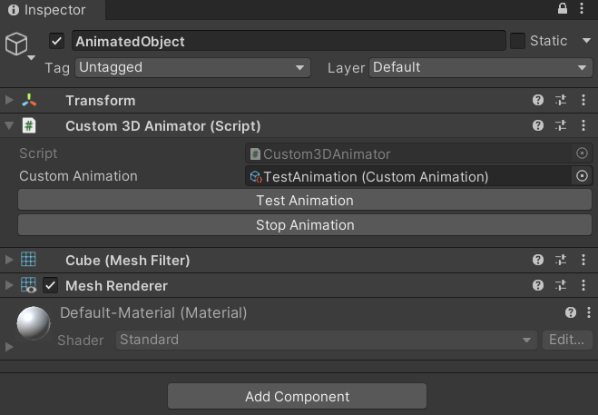
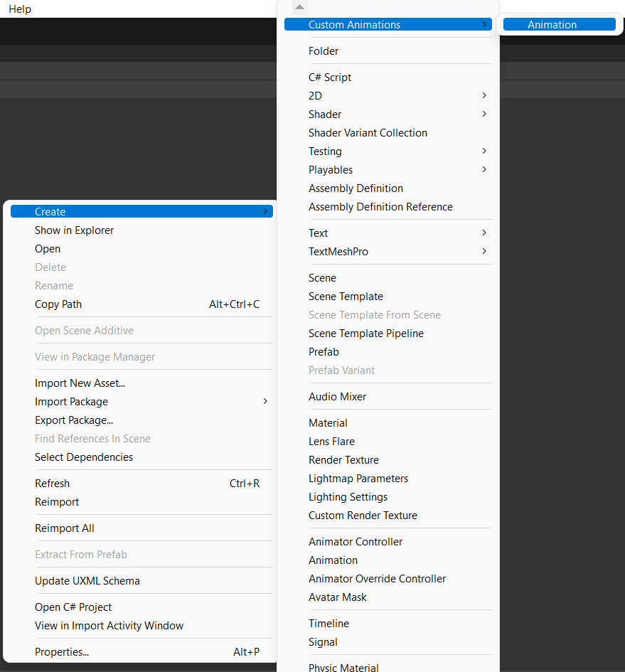
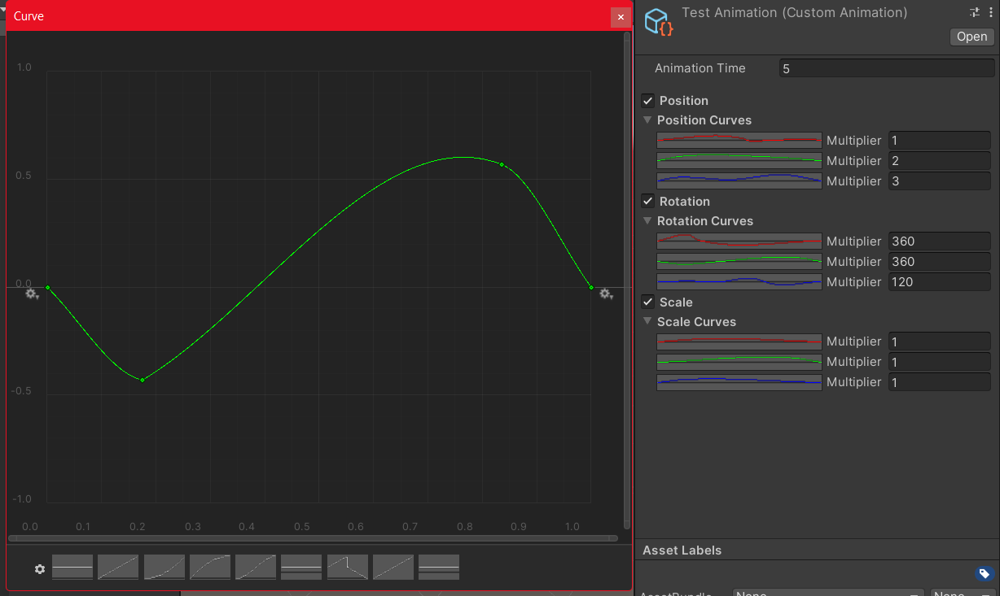

# CurveBased3DAnimator
### A simple tool to make script based animation using animation curves

-Unity 2021.3.1f1

[Package Download](https://drive.google.com/file/d/1ad499tegmnf8t8n1VHE-na3gxuU05aNf/view?usp=sharing)

# REQUISITES
* "Editor Cororutines" Unity Package Installed in the project

# HOW TO USE

## GET STARTED
**To Get Started You'll need to do 3 things**

1. Create a Gameobject with the "Custom 3D Animator" component.

2. Create a customAnimation scriptable object (in project window: right click -> Create -> Custom Animations -> Animation) and set the curves at will.

 

3. Reference the created ScriplableObject in the "Custom Animation" field of the component.

## START ANIMATION

### Editor
* Press the "Start Animation" button and tweak the values if needed.

### Code
* Get a reference to the script and then call one of the "StartAnimation()" method's overloads, changing the parameters based on the situation.

### **ENJOY YOUR MOVING THINGY**

# Known Issues

* The curves validation system (if the last keframe time isn't 1 a new keyframe is created to keep the curve normalized) works only when the scriptableObject's inspector gets repainted and not when a curve gets edited.

